## chrome 配置
* 1 [Stylish](#1_Stylish)
* 2 [Vimium](#2_Vimium)
* 3 [印象笔记剪藏](#3_印象笔记剪藏)
* 4 [新同文堂](#4_新同文堂)
* 5 [极速下载助手](#5_极速下载助手)
* 6 [onetab浏览器多标签记录器](#6_onetab浏览器多标签记录器)
* 7 [postmanhttp请求调试神器](#7_postmanhttp请求调试神器)
* 8 [翻墙神器](#8_翻墙神器)

<a id="1_Stylish" />
##1 Stylish

chrome浏览器默认的白色背景对经常需要看浏览器的人来讲太不友好了。好在chrome浏览器有一个自定义背景色的插件Stylish!

#### 安装Stylish插件
这个Stylish插件可以在google扩展应用的商店下载安装即可。

#### 添加样式
安装完了之后就需要下载一些网页背景的样式，如图01所示，点击"查找此网站的更多样式"来在`https://userstyles.org`上选择安装自己喜欢的style。

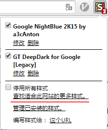

#### 设置样式
添加完样式之后，自然就要将样式应用到网页上，如图02所示，Stylish设置主要有键盘映射和应用对象两个，
**键盘映射**, 可选列表:
* vim
* emacs
* sublime
* ...

比如可以选择vim映射，这个联合chrome下的另一神器插件vimium 简直是绝配!

**应用对象** 可选列表:
* 网址 - 就是只对这个网址应用此样式
* 网址前缀 - 这个就是符合这个前缀的网址都适应
* 该域上的网址 -这个适用某个网站下的所有子网址，比如输入www.google.com 那么www.google.com这个主站下的所有映射的网址都适用
* 与该正则表达式匹配的网址 -这个一般用不到

比如我经常用的`GT DeepDark for Google[Legacy]`样式，我想所有的网页都应用这个样式，那我就可以添加 `网址前缀 http://` 和 `网址前缀 https://`,这样基本就覆盖我所用的全部网址了。

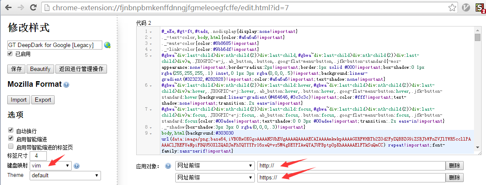

**目前经常用的样式**
* GT DeepDark for Google[Legacy] -这个最常用(灰黑色背景，护眼最舒服了)
* Google NightBlue 2K15 by a3cAnton
* Stackoverflow Dark
* Youtube - Dark Grey

如图03所示，

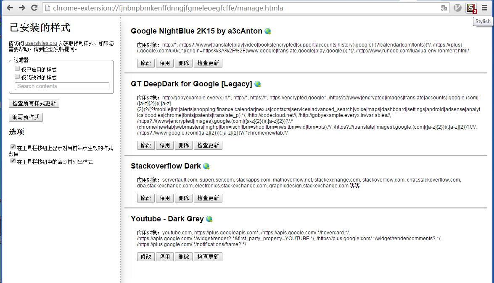

<a id="2_Vimium" />
##2 Vimium

频繁使用浏览器或者经常需要在不同的页面快速翻阅的话，用键盘快捷键往往比鼠标去点击更快；要想快捷键用得好，只有一个字：多用。好在chrome浏览器上有一款vim的快捷键映射神器`Vimium`。开始不记得快捷键没关系， 只需要键入`shift+?`组合键，快捷键提示框就跳出来了。

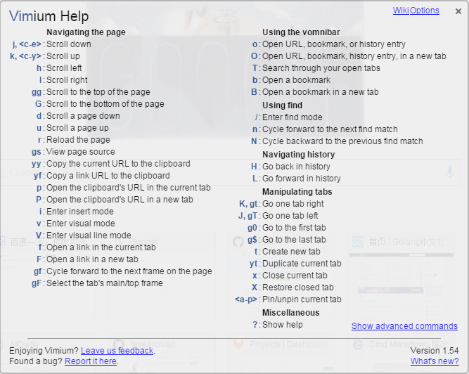

<a id="3_印象笔记剪藏"/>
##3 印象笔记剪藏

作为经常需要检索资料的重度用户，经常会打开N多网页，总觉得值得过后再来一看，但是N多页面打开会严重吃掉内存，所以一般到下午的时候我的机器就巨卡，自从有了`印象笔记剪藏`之后，再也不用担心发现好的网页被关闭之后看不到了，右键点击`印象笔记剪藏`剪藏整页或剪藏网址，随时随地都可以看。

<a id="4_新同文堂" />
##4 新同文堂

有时候我们看到的有价值的网页是繁体的页面，很多字都很难辨认严重影响参阅速度，那就可以使用`新同文堂`,安装之后做如下设置如`图01`和`图02` ,从此之后就再也见不到充满繁体的网页了。

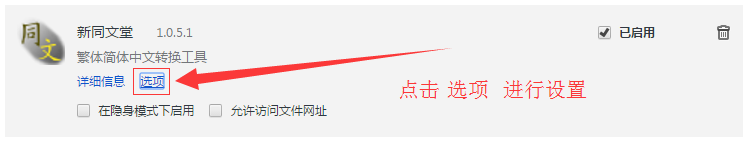

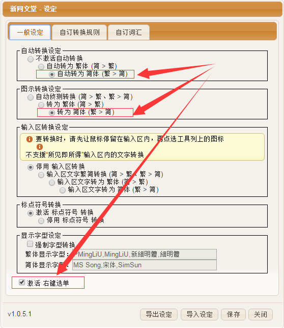

<a id="5_极速下载助手"/>
##5 极速下载助手

经常用浏览器免不了用浏览器下载资源，但是有时候资源太大的时候往往需要很长时间才能下载下来;但是如果中间网络中断的话又得重新下载，而不能续传下载，这对下载大文件来讲简直是灾难，但是往往点击下载本地都会启动浏览器自带的下载工具进行下载，如何不启用浏览器的下载工具自动下载呢？ 那就可以借用`极速下载助手`来设置默认下载方式，如`图01`和 `图02`， 非常方便。

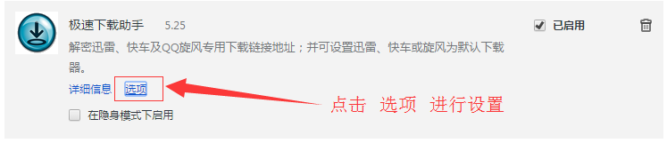

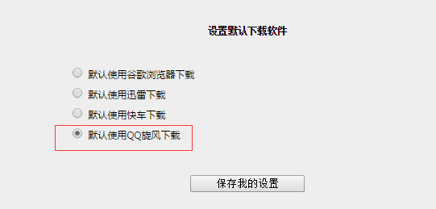

##6 onetab浏览器多标签记录器

用onetab插件可以解放95%的chrome浏览器内存占用。

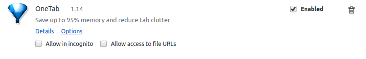

Chrome 的特点之一，就是为每个标签页单开一个进程，减少崩溃的几率的同时能保证一个标签页崩溃不会导致整个浏览器崩溃。同时，Chrome 的内存占用一直是一个不大不小的问题，标签页数量较多时消耗的内存相当可观。对内存不是那么大的人来说，用一段时间之后整个系统被拖得很慢着实非常痛苦。

从 Chrome Web Store 安装插件之后，点击 Chrome 右上角显示的 OneTab 按钮，你当前所有打开的页面都会被关闭，整合呈现成为一个列表，显示在一个新打开的 OneTab 标签页中。但是要注意的是，这时显示的标签页列表仅仅是一个链接的集合，点击打开某个标签页时相当于打开新页面，需要重新载入。

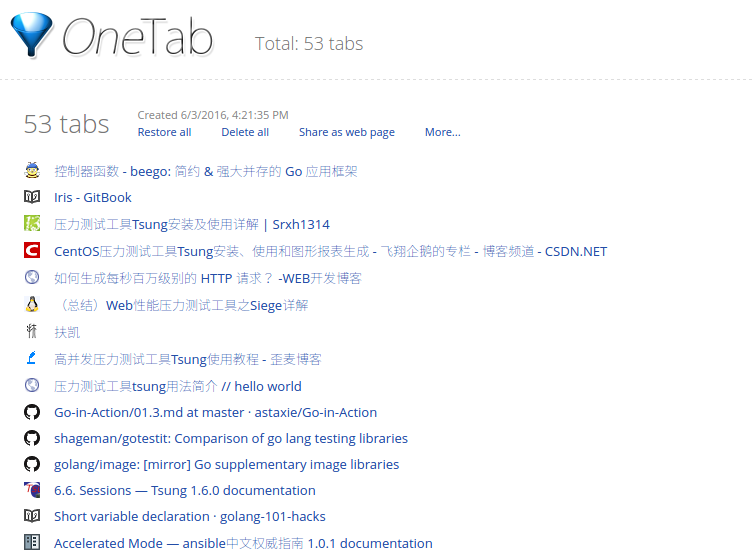

使用 OneTab 数次之后，OneTab 页面上会按照你每次使用的时间点分开记录整理当时整理的标签页列表，也可以按照时间点选择删除全部记录，或者重新打开全部页面。当然，你也可以在网址的左边点按叉标志单独删除页面。另外，还可以按照时间点将该次整理的标签页以 QR 码的形式分享给别人，使用 QR 扫描器扫描之后会在浏览器打开一个包含分享内容的页面。

与`onetab`功能类似的还有一款`tabs outliner`

`tabs outliner`号称标签管理系统， 它会在浏览器旁边新建一个窗口，把所有的标签页按照域名归类放好，如果你想要查找标签页的话就会变得十分容易。如果你的屏幕是宽屏的话更适合。

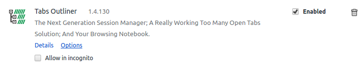

##7 postmanhttp请求调试神器

在我们平时开发中，特别是需要与接口打交道时，无论是写接口还是用接口，拿到接口后肯定都得提前测试一下，这样的话就非常需要有一个比较给力的Http请求模拟工具，现在流行的这种工具也挺多的，像火狐浏览器插件-RESTClient，Chrome浏览器插件-Postman等等。

Postman是一种网页调试与发送网页http请求的chrome插件。我们可以用来很方便的模拟get或者post或者其他方式的请求来调试接口。

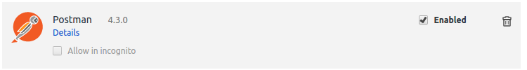

##8 翻墙神器

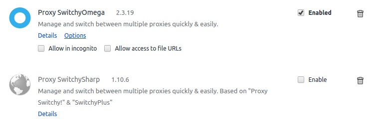

翻墙神器的规则配置(长城防火墙)

**Rule List URL:** `https://raw.githubusercontent.com/gfwlist/gfwlist/master/gfwlist.txt` 

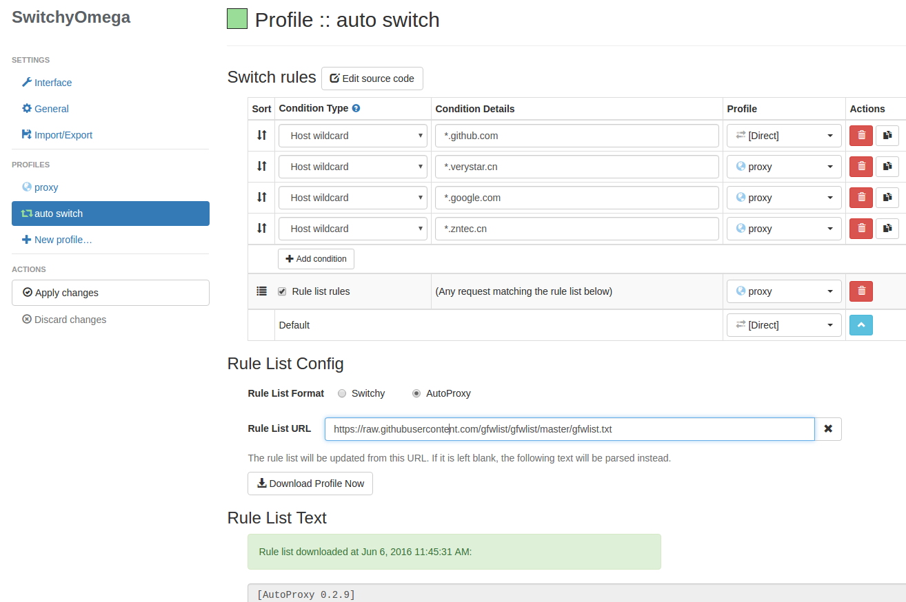
