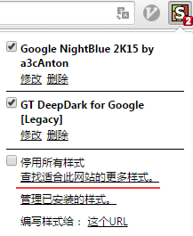

# chrome 配置

------
chrome浏览器默认的白色背景对经常需要看浏览器的人来讲太不友好了。好在chrome浏览器有一个自定义背景色的插件Stylish!

#### 安装Stylish插件
这个Stylish插件可以在google扩展应用的商店下载安装即可。

#### 添加样式
安装完了之后就需要下载一些网页背景的样式，如图01所示，点击"查找此网站的更多样式"来在`https://userstyles.org`上选择安装自己喜欢的style。

#### 设置样式
添加完样式之后，自然就要将样式应用到网页上，如图02所示，Stylish设置主要有键盘映射和应用对象两个，
**键盘映射**, 可选列表:
* vim
* emacs
* sublime
* ...

比如可以选择vim映射，这个联合chrome下的另一神器插件vimium 简直是绝配!

**应用对象** 可选列表:
* 网址 - 就是只对这个网址应用此样式
* 网址前缀 - 这个就是符合这个前缀的网址都适应
* 该域上的网址 -这个适用某个网站下的所有子网址，比如输入www.google.com 那么www.google.com这个主站下的所有映射的网址都适用
* 与该正则表达式匹配的网址 -这个一般用不到

比如我经常用的`GT DeepDark for Google[Legacy]`样式，我想所有的网页都应用这个样式，那我就可以添加 `网址前缀 http://` 和 `网址前缀 https://`,这样基本就覆盖我所用的全部网址了。

**目前经常用的样式**
* GT DeepDark for Google[Legacy] -这个最常用(灰黑色背景，护眼最舒服了)
* Google NightBlue 2K15 by a3cAnton
* Stackoverflow Dark
* Youtube - Dark Grey

如图03所示，

